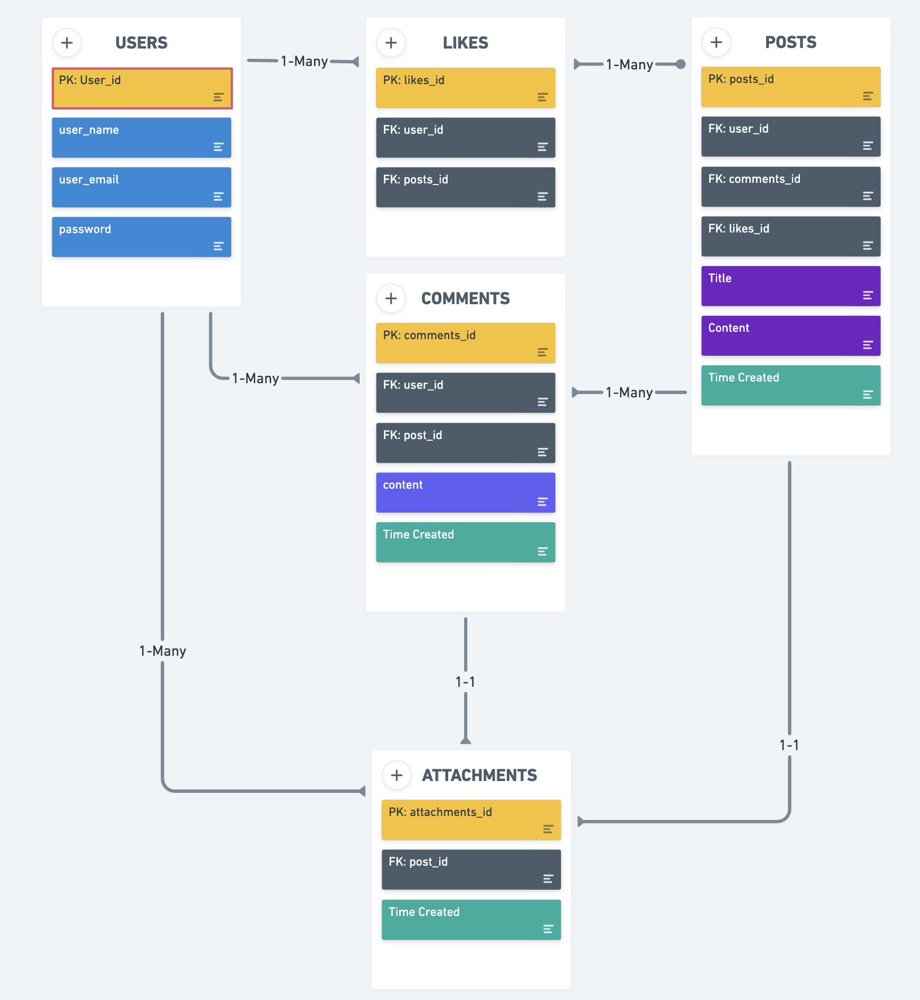
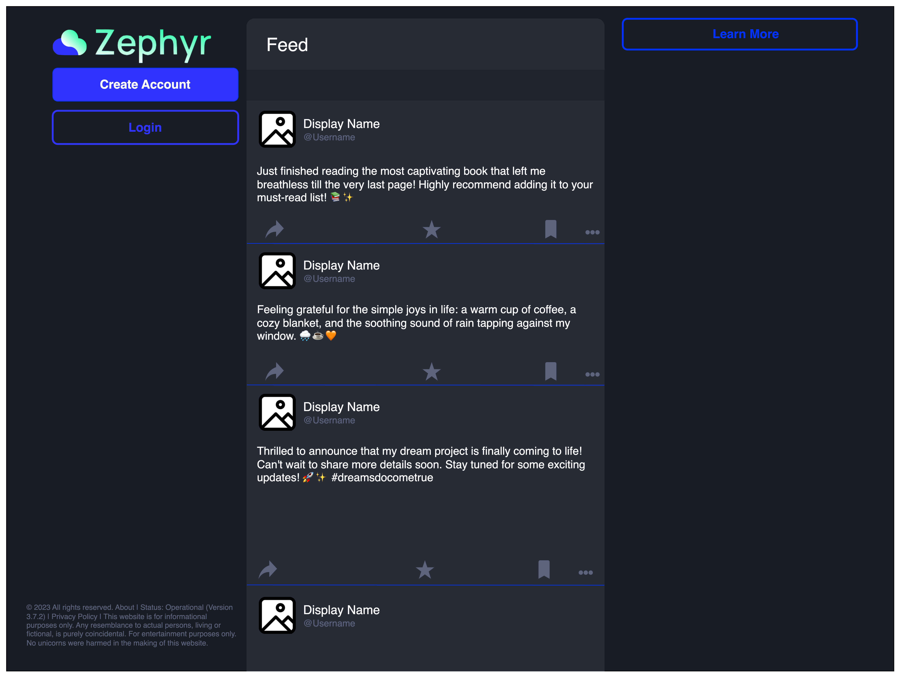
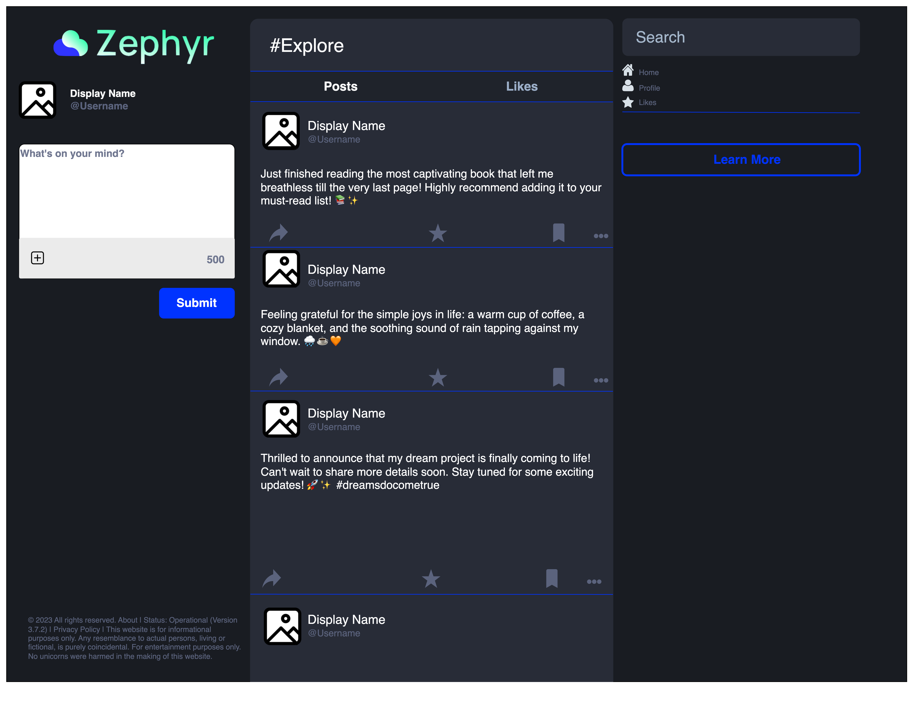
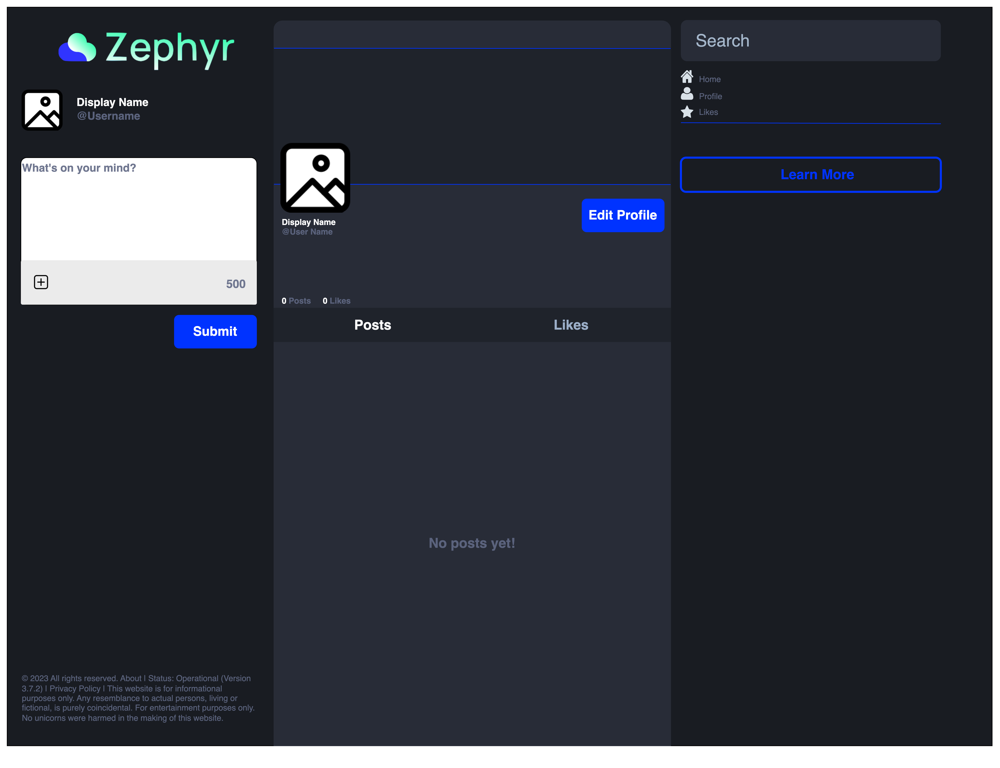
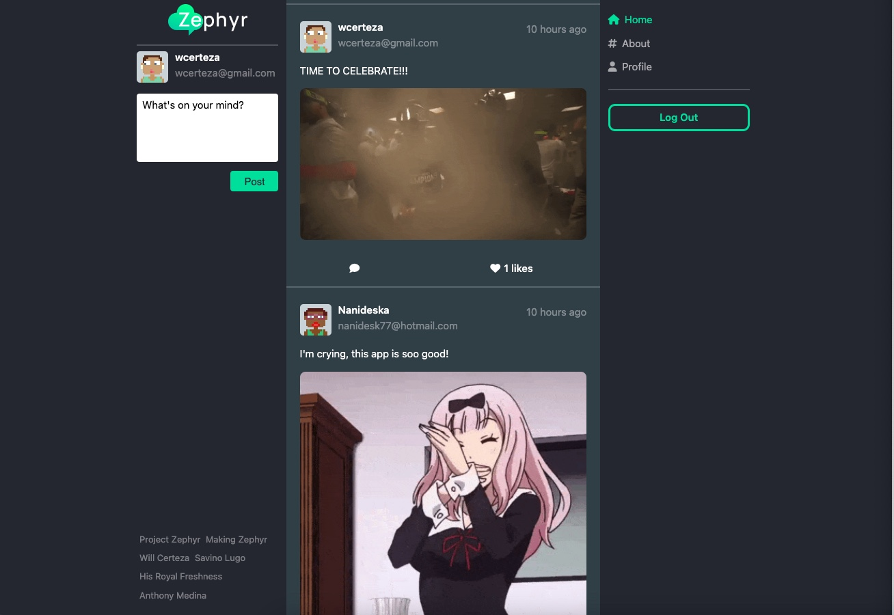
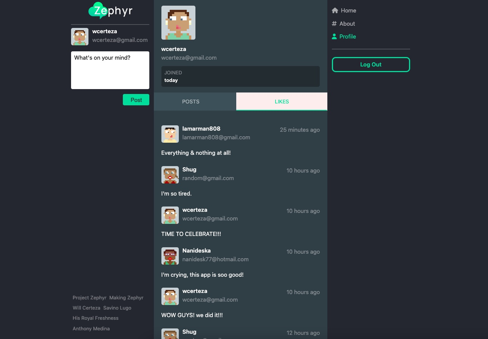
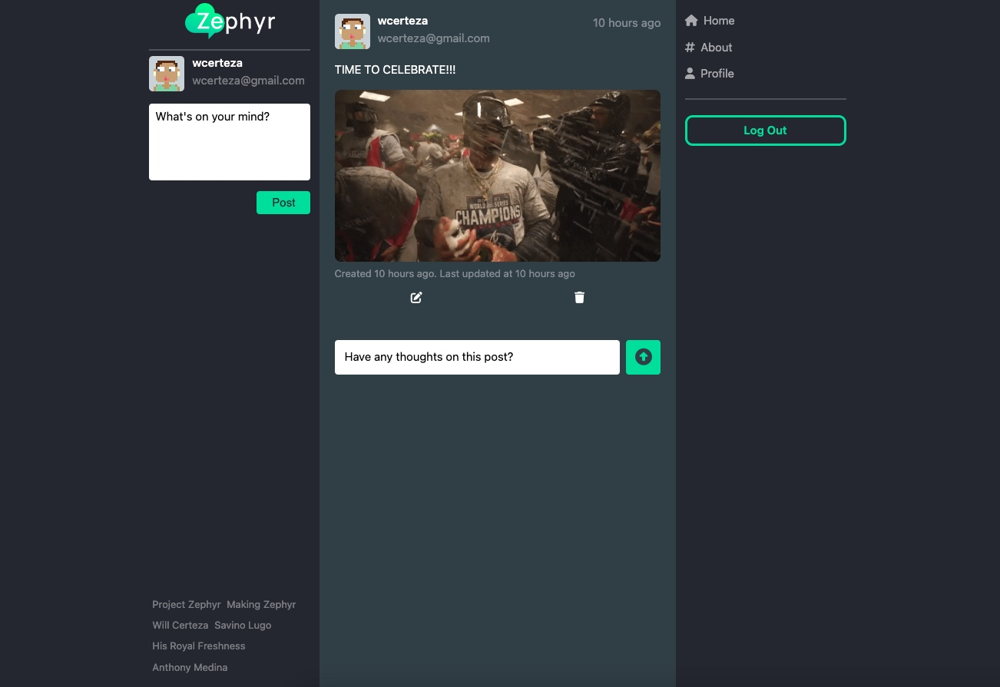
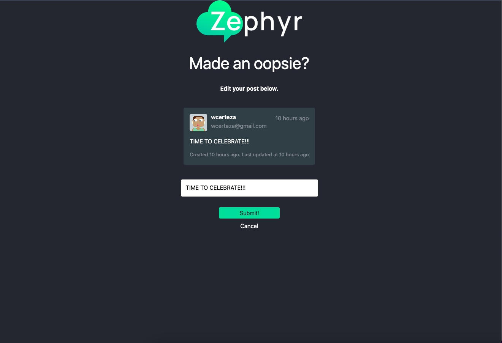

# Zephyr

## Date: 6/14/23

---

### **Creators**

#### [Will Certeza](https://github.com/wcerteza)

#### [Anthony Medina](https://github.com/ajm24027)

#### [Savino Lugo](https://github.com/SavinoLugo)

#### [Kendal Chaney](https://github.com/lamarman808)

---

### **_Description_**

#### Introducing Zephyr: A Thriving Community Platform Reinventing Online Discussions!

Zephyr is a cutting-edge alternative to traditional online forums, revolutionizing the way we engage and connect. Powered by the robust trio of PostgreSQL, Django, and Python, Zephyr offers a dynamic and feature-rich experience for users seeking vibrant communities and stimulating conversations.

---

### **_Technologies_**

---

### **_Links_**

#### Vist our website here: [Zephyr](https://zephyr1.fly.dev/)

#### [Trello](https://trello.com/b/pyqT9my7/zephyr)

#### [Pitch Deck](https://www.figma.com/file/dhFt9fPjhOFSCzPvjIc49H/Zephyr-Pitch-Deck?type=design&node-id=0%3A1&t=jpPi6djm3mNODYcP-1)

---

### **_Entity Relationship Diagram_**

### **_WireFrame_**

---

### **_Completed Website_**

#### Comprehensive feature list on our platform's information page.

#### Engaging stream page for creating, liking, commenting on, and viewing all posts.

#### Personal profile page to view your own profile, liked posts, and created posts. Includes membership date, username, avatar, and user email.

#### Individual post display with options to update or delete your own post, or leave a comment on others' posts.

#### Update page displaying the entire post you wish to modify, accessible after clicking the update button.

#### Each user has a custom randomily generated avatar, we made this happen using [DiceBear](https://www.dicebear.com/introduction) an HTTP API.

---

### **_Production Goals_**

#### 1. Include a minimum of 3 Django Models, and have full CRUD operations on at least one of them.

#### 2. Implement User Authentication utilizing protected routes.

#### 3. Deploy Zephyr to a hosting production environment.

---

### **_Future Goals_**

#### 1.Implement a private chat feature, allowing individual users to engage in private conversations.

#### 2. Develop additional features within Zephyrs, such as the ability to create sub-zephyrs or topic-specific communities, providing users with more specialized discussions and content.

---

### **_Refrences_**

[DiceBear](https://www.dicebear.com/introduction)

[FontAwesome](https://fontawesome.com/)

[About Page](https://postimg.cc/PPf4FhDK)

[About Page Images 2](https://postlmg.cc/SJZGB574)

[CSS animations](https://developer.mozilla.org/en-US/docs/Web/CSS/CSS_animations/Using_CSS_animations)

---
